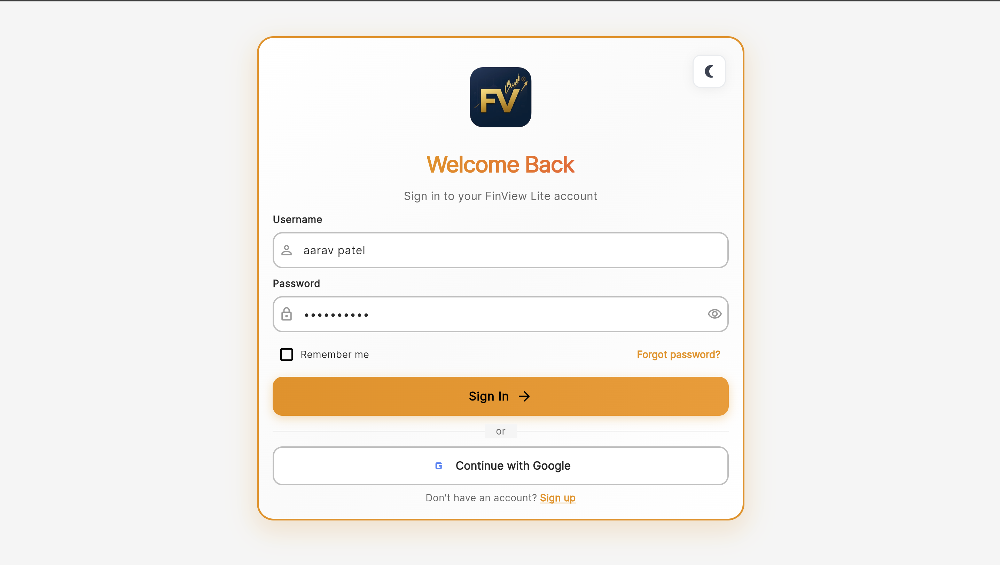
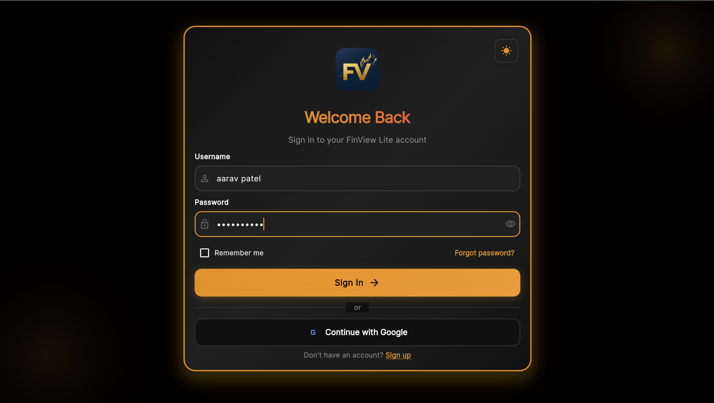
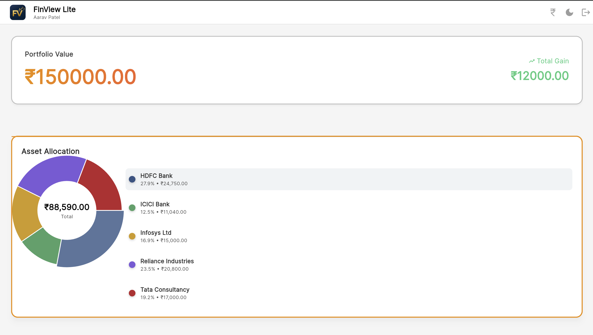
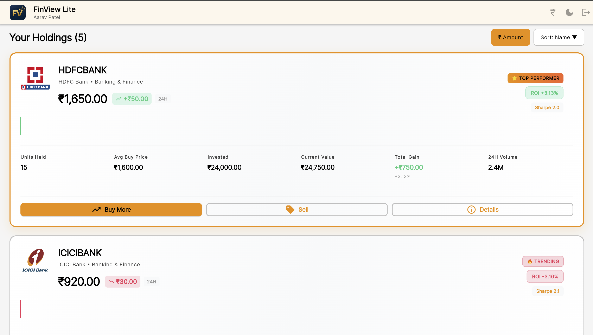
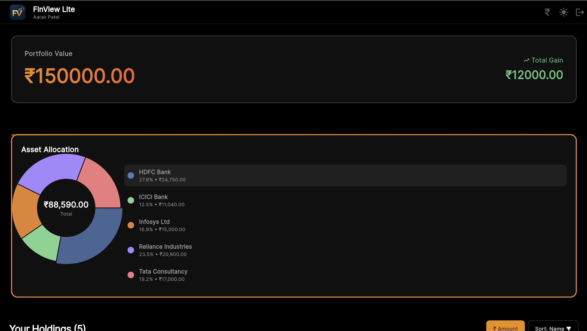
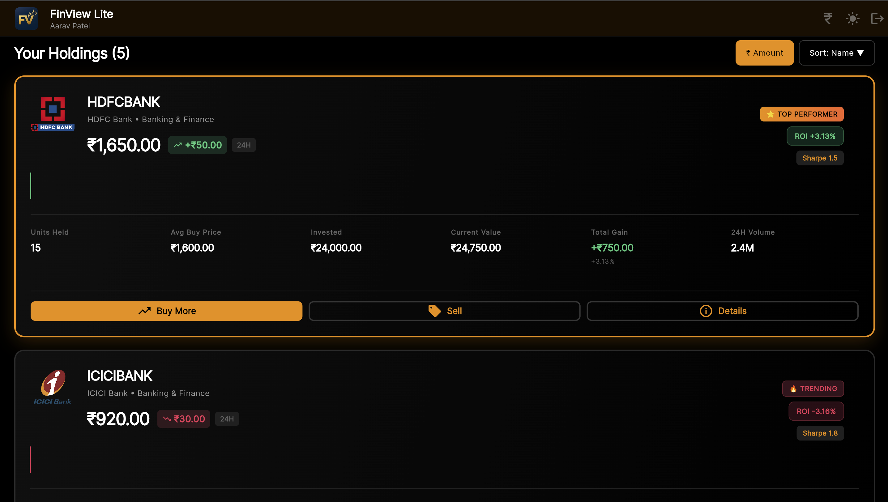

# FinView Lite — Investment Dashboard

A Flutter mobile/web dashboard for visualizing investments, asset allocation, and returns using mock data.

## Features

- Portfolio summary showing total value and gain/loss
- Individual holdings display with name, units, cost, current value, and gain/loss
- Interactive pie chart showing asset allocation across holdings
- Toggle to view returns in percentage or amount (₹)
- Sort holdings by name, value, or gain
- Responsive design for mobile and web
- Error handling for empty data and edge cases

## Bonus Features

- Dark mode toggle with persistent theme (SharedPreferences)
- Mock login screen with state persistence
- Pull-to-refresh to simulate price updates

## Additional Features

- Company logos for each holding (HDFC Bank, ICICI Bank, Infosys, TCS, Reliance)
- Enhanced UI with hover effects and animations
- Professional login screen with form validation
- Custom app logo

## Setup

### Prerequisites

- Flutter SDK (version 3.0.0 or higher)
- Dart SDK (included with Flutter)

### Installation

1. Clone the repository:
```bash
git clone <repository-url>
cd finview_lite
```

2. Install dependencies:
```bash
flutter pub get
```

3. Run the app:
```bash
# For web
flutter run -d chrome

# For mobile
flutter run
```

## Project Structure

```
finview_lite/
├── lib/
│   ├── main.dart                 # App entry point
│   ├── models/
│   │   └── portfolio.dart       # Data models
│   ├── services/
│   │   ├── portfolio_service.dart  # JSON loading
│   │   └── logo_service.dart      # Logo management
│   ├── screens/
│   │   ├── login_screen.dart     # Login screen
│   │   └── dashboard.dart        # Main dashboard
│   ├── widgets/
│   │   ├── portfolio_summary.dart
│   │   ├── allocation_chart.dart
│   │   ├── holding_card.dart
│   │   └── holdings/
│   ├── providers/
│   │   ├── theme_provider.dart
│   │   └── auth_provider.dart
│   └── utils/
│       ├── formatters.dart
│       └── responsive.dart
├── assets/
│   ├── portfolio.json           # Mock portfolio data
│   └── logos/                   # Company logos
└── README.md
```

## Mock Data

The app uses `assets/portfolio.json` for portfolio data. Example format:

```json
{
  "user": "Aarav Patel",
  "portfolio_value": 150000,
  "total_gain": 12000,
  "holdings": [
    {
      "symbol": "TCS",
      "name": "Tata Consultancy",
      "units": 5,
      "avg_cost": 3200,
      "current_price": 3400
    }
  ]
}
```

## Dependencies

- `fl_chart: ^0.66.0` - Chart library
- `intl: ^0.19.0` - Number formatting
- `shared_preferences: ^2.2.2` - Local storage
- `provider: ^6.1.1` - State management
- `shimmer: ^3.0.0` - Loading animations

## Screenshots













## Demo Video

[Link to demo video](https://youtu.be/xxx)

The demo shows:
- Login functionality
- Theme toggle
- Sorting and filtering
- Chart interactions
- Refresh feature

## How to Use

1. **Login**: Enter any username and password to access the dashboard
2. **View Portfolio**: See total value and gain/loss at the top
3. **Asset Allocation**: View pie chart showing distribution across holdings
4. **Sort Holdings**: Click "Sort" button to cycle through name, value, or gain
5. **Toggle View**: Switch between ₹ amount and % percentage using the toggle
6. **Refresh**: Pull down to refresh and simulate price updates
7. **Theme**: Toggle between light and dark mode using the theme button

## Error Handling

The app handles:
- Empty portfolio data
- Invalid JSON format
- Missing required fields
- Zero or negative values
- Network errors (for logo loading)

## Code Organization

- Models: Data structures for Portfolio and Holding
- Services: Business logic for loading data and refreshing prices
- Screens: Main UI screens (Login, Dashboard)
- Widgets: Reusable UI components
- Providers: State management for theme and authentication
- Utils: Helper functions for formatting and responsive design

## License

This project is created for educational/assignment purposes.
